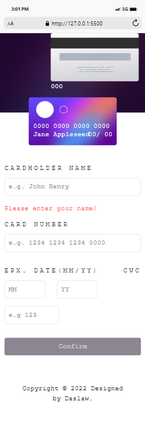

# WEB3BRIDGE - Frontend Mentor | FAQ Accordion Card solution

This is a solution to Interactive Card Details for WEB2CVII TEAM 1

## Overview

This challenge was gotten from Frontend Mentor and facilitated by WEB3BRIDGE.

**To do this challenge, you need a basic understanding of HTML, Advance CSS, Bootstrap and JavaScript.**

### The challenge

Users should be able to:

- View the optimal layout depending on their device's screen size

### Screenshots

### Links

- Solution URL: (https://github.com/Daslaw/interactive_card.git)
- Live Site URL:(https://daslaw.github.io/interactive_card/)

## My process

- Write and Format the HTML section of the Project
- Styling with CSS and Bootstrap
- JavaScript for DOM
- Pushed and host on GITHUB 

### Built with

- Semantic HTML5 markup
- CSS custom properties
- Bootstrap
- JavaScript

### Tools

- VScode
- Chrome Browser

### What I learned

- CSS styling Media Query
- Bootstrap
- JavaScript

## Acknowledgments

Thanks to my mentor @Adetutu777 and @WEB3BRIDGE for this opportunity.